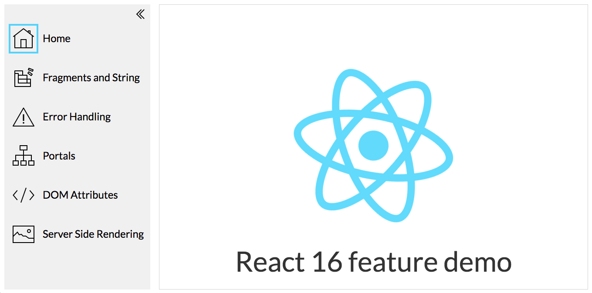
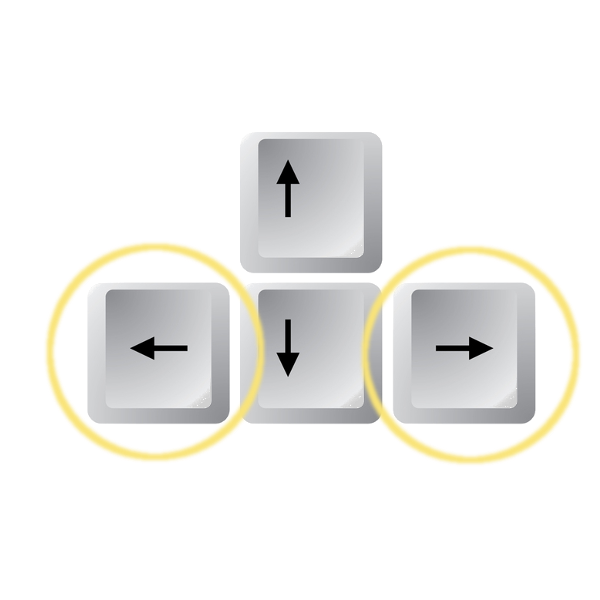

This project was bootstrapped with [Create React App](https://github.com/facebookincubator/create-react-app).

Below you will find some information on how to perform common tasks.<br>
You can find the most recent version of this guide [here](https://github.com/facebookincubator/create-react-app/blob/master/packages/react-scripts/template/README.md).


## Description

This project is a short demonstration of React 16 new features

### Install Dependencies
```bash
npm install
```

### Available scripts

### `npm start`

Runs the app in the development mode.<br>
Open [http://localhost:3000](http://localhost:3000) to view it in the browser.

The page will reload if you make edits.<br>
You will also see any lint errors in the console.


### `npm run build`

Builds the app for production to the `build` folder.<br>
It correctly bundles React in production mode and optimizes the build for the best performance.

The build is minified and the filenames include the hashes.<br>
Your app is ready to be deployed!


### Deploy to GitHub Pages

### `npm run deploy`
Deploys and enable to host project directly from a GitHub repository.

Open [https://kiragona.github.io/react-16-features/] to view it in the browser.




### Navigation Instructions
|                                                                    |                                                        |
| ------------------------------------------------------------------ |:------------------------------------------------------:|
| | use LEFT/RIGHT arrow keys to navigate through the menu |
|    | use UP/DOWN arrow keys to navigate inside main view    |

